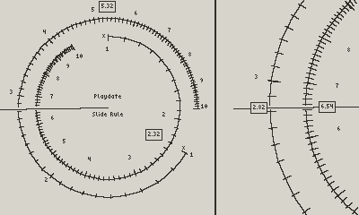
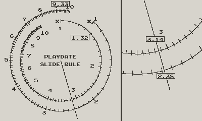
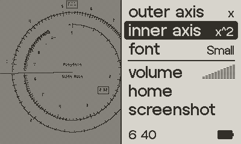

# A Slide Rule for the Playdate Handheld Game Console

## What?

It's a circular slide rule for the playdate

## Action Shots

*Can do math!* 2.32 * 2.82 = 6.54:

*Accessible!* Has large fonts for anyone old enough to use slide rules:

*Highly configurable!* Choose axes as well as fonts:

## How do I use it?

* Use the crank to turn the hairline
* Hold A, B when turning the crank to rotate those axes instead
* Multiple Axes supported: x, x^2, x^3, 1/x, linear, sin/cos/tan

## Why?

Actually, I have something else in mind, and this is a precursor. Figured
I'd do this first, release the code to anyone curious, and worry about
the next thing next.

## What, Again?

PlayDate is this cute little game console that's surprisingly awesome:
http://play.date

Before you kids with your new fangled "phones" and "calculators", people
used slide rules to do maths: https://en.wikipedia.org/wiki/Slide_rule

## Why, Again?

Because slide rules are awesome. And the playdate's crank is clearly
designed for controlling a circular slide rule

## Fonts

The fonts are borrowed from https://devforum.play.date/t/some-small-fonts/1356
Created by Donald Hays / Dovuro

Cheers,  
Gary <chunky@icculus.org>

